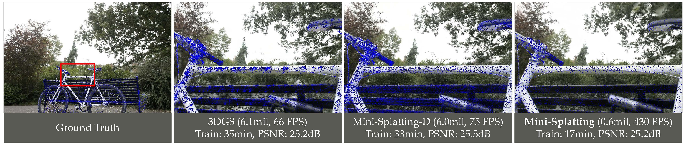

# Mini-Splatting: Representing Scenes with a Constrained Number of Gaussians

This is the official implementation of **Mini-Splatting**, a point cloud analysis work in the context of Gaussian Splatting. Through reorganizing the spatial distribution of 3D Gaussians, our algorithm improves the model performance without any auxiliary information. For technical details, please refer to:

**Mini-Splatting: Representing Scenes with a Constrained Number of Gaussians**  <br />
Guangchi Fang and Bing Wang.<br />
**[[Paper](https://arxiv.org/pdf/2403.14166.pdf)]** <br />

<p align="center">  </p>


### (1) Setup
This code has been tested with Python 3.7, torch 1.12.1, CUDA 11.6.

- Clone the repository 
```
git clone git@github.com:fatPeter/mini_splatting.git && cd mini_splatting
```
- Setup python environment
```
conda create -n mini_splatting python=3.7
conda activate mini_splatting
pip install torch==1.12.1+cu116 torchvision==0.13.1+cu116 -f https://download.pytorch.org/whl/torch_stable.html
pip install -r requirements.txt
```


- Download datasets: [Mip-NeRF 360](https://jonbarron.info/mipnerf360/), [T&T+DB COLMAP](https://repo-sam.inria.fr/fungraph/3d-gaussian-splatting/datasets/input/tandt_db.zip).


### (2) Mini-Splatting (Densification and Simplification)

Training scripts for Mini-Splatting are in `ms`:
```
cd ms
```
- Train with train/test split:
```
# mipnerf360 outdoor
python train.py -s <dataset path> -m <model path> -i images_4 --eval --imp_metric outdoor
# mipnerf360 indoor
python train.py -s <dataset path> -m <model path> -i images_2 --eval --imp_metric indoor
# t&t
python train.py -s <dataset path> -m <model path> --eval --imp_metric outdoor
# db
python train.py -s <dataset path> -m <model path> --eval --imp_metric indoor
```

- Modified full_eval script:
```
python full_eval.py -m360 <mipnerf360 folder> -tat <tanks and temples folder> -db <deep blending folder>
```


### (3) Mini-Splatting-D (Densification only)

- Training scripts for Mini-Splatting-D are in `ms_d`:
```
cd ms_d
```
- Train with train/test split:
```
# mipnerf360 outdoor
python train.py -s <dataset path> -m <model path> -i images_4 --eval
# mipnerf360 indoor
python train.py -s <dataset path> -m <model path> -i images_2 --eval
# t&t
python train.py -s <dataset path> -m <model path> --eval
# db
python train.py -s <dataset path> -m <model path> --eval
```

- Modified full_eval script:
```
python full_eval.py -m360 <mipnerf360 folder> -tat <tanks and temples folder> -db <deep blending folder>
```

### (4) Mini-Splatting-C (Mini-Splatting with Compression)

- Scripts for Mini-Splatting-C are in `ms_c`:
```
cd ms_c
```
- Compress, decompress and evaluate (use the model path of the pretrained Mini-Splatting):
```
python run.py -s <dataset path> -m <model path>
```


**Acknowledgement.** This project is built upon [3DGS](https://github.com/graphdeco-inria/gaussian-splatting).


